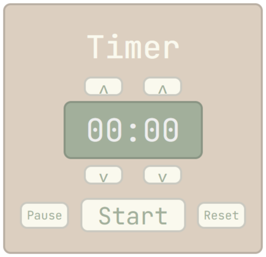

# Timer


## Description
Allows users to pause, resume, and restart the timer. Includes interactive display with up/down controls for setting minutes and seconds.

## Built With
- `HTML`
- `CSS`
- `JavaScrip`

## Features
- Set custom timer duration with up/down buttons
- Clean, minimalist interface
- Responsive design

## Installation

### Prerequisites
- A modern web browser (Chrome, Firefox, Safari, Edge)
- (Optional) A code editor like VS Code to view/modify the code

### Running the Project
To run the project in your local environment, follow these steps:
1. Clone the repository to your local machine:
      ```bash
   git clone https://github.com/your-username/timer-app.git
   cd timer-app
2. Run using one of these methods:
   - **Basic Method**: Open `index.html` in your browser
   - **VS Code**: Install `Live Server` extension and open with Live Server

## License
This project is licensed under the [MIT] License - see the `LICENSE.md` file for details
